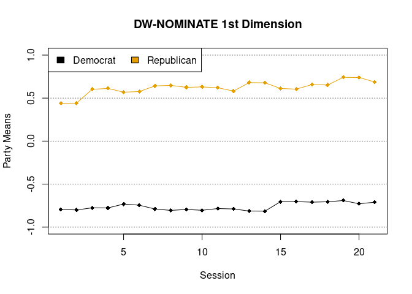

<!-- README.md is generated from README.Rmd. Please edit that file -->

# dwnominate

[](https://github.com/wmay/dwnominate/actions)
[](https://codecov.io/gh/wmay/dwnominate?branch=master)
[](https://zenodo.org/badge/latestdoi/48529209)

DW-NOMINATE dynamic roll call scaling in R

## Installation

Installation requires a Fortran compiler as well as BLAS and LAPACK
libraries. On Windows these are conveniently available as part of
[Rtools](https://cran.r-project.org/bin/windows/Rtools/). MacOS includes
BLAS and LAPACK, so it only requires installing a Fortran compiler. I
recommend following the advice provided by CRAN
[here](https://cran.r-project.org/bin/macosx/tools/). On Linux these
will be installed with the `r-base-dev` library (or the equivalent for
your distribution).

Once the dependencies are satisfied, the package can be installed from R
by running:

``` r
install.packages('remotes')
remotes::install_github('wmay/dwnominate')
```

## DW-NOMINATE

Running DW-NOMINATE:

``` r
library(dwnominate)
# get a list of `rollcall` objects
data(nhsenate)
results <- dwnominate(nhsenate)
plot(results)
```

<!-- -->

`dwnominate()` takes as its main argument a list of `rollcall` objects
from the
[`pscl`](https://cran.r-project.org/web/packages/pscl/index.html)
package. The results are returned as a `dwnominate` object with
estimates of legislator and roll call coordinates. Get detailed
information about DW-NOMINATE options with `?dwnominate` and
`help(package=dwnominate)`.

## Citation

Please use the citation provided by Zenodo:
[](https://zenodo.org/badge/latestdoi/48529209)
